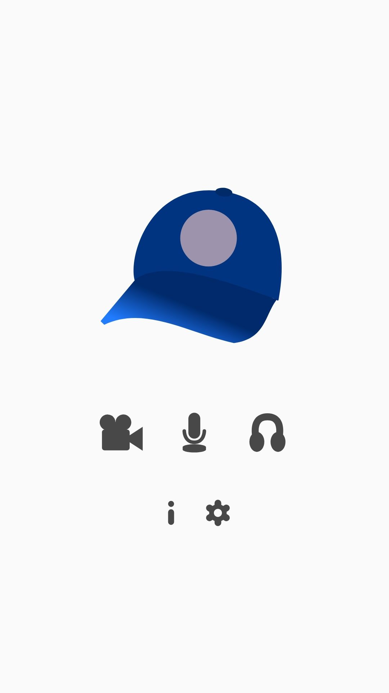
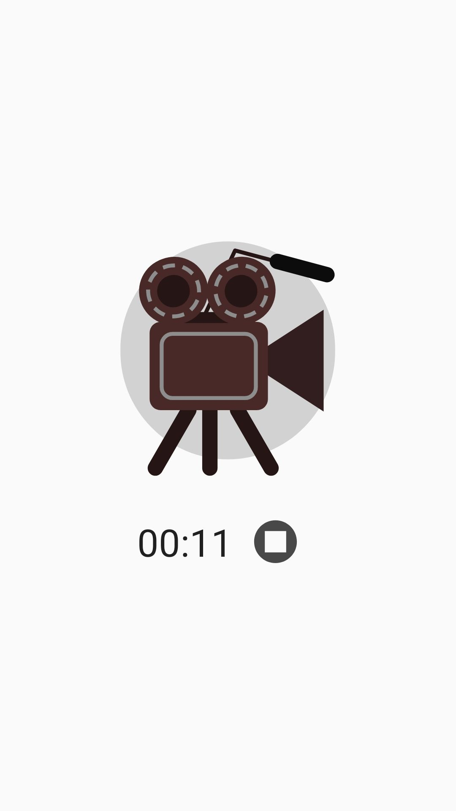

# CaptureCap
***Capture Android screen and/or Audio.***

 

*Audio Playback recording requires Android 10 or later. No Root needed*

*(**WARNING**: Some device vendors may not allow recording certain Audio Playback sources, or even recording applications' audio at all)*
