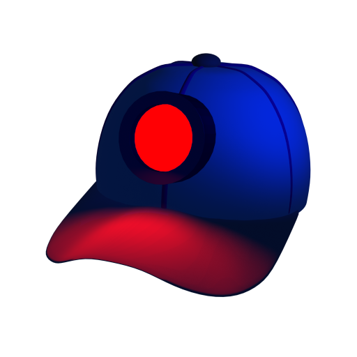
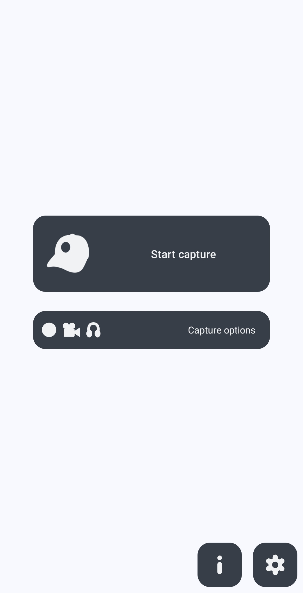
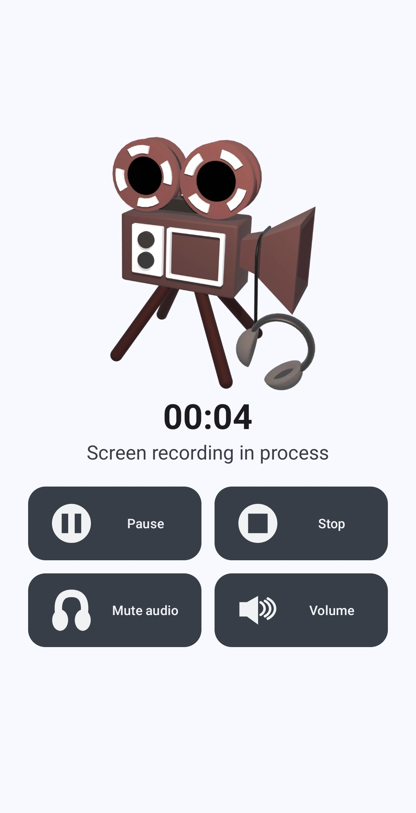
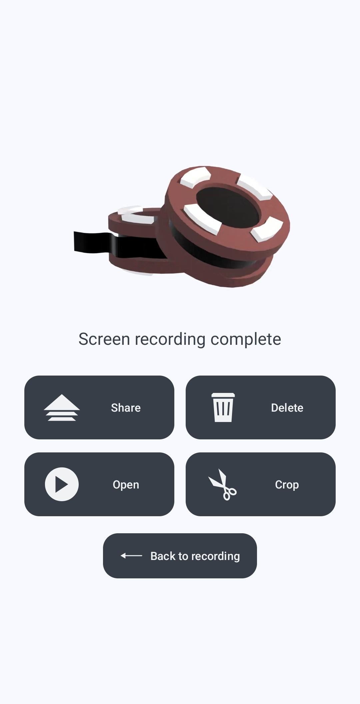

# CaptureCap

***Capture and Stream Android Screen and/or Audio.***

| :robot: AI Notice                                                                                  |
|:---------------------------------------------------------------------------------------------------|
| This program has code assisted/written by the AI. For more information, please see [AI.md](AI.md)  |

*Audio Playback recording requires Android 10 or later. No Root needed*

*(**WARNING**: Some device vendors may not allow recording certain Audio Playback sources, or even recording applications' audio at all)*

## Screenshots

  

## Donations

You can support the author by donating with cryptocurrencies.

Wallet list

 

**BTC**: `bc1q6jp0g9jhrcx5l75gyg4c698yvg5qtm08j826p5`

**ETH**: `0x7b3E49fd98D64E965a4F26F67C236Dc80C31766D`

**USDT**: `TNfBpVveyvDBYCUvScFQKjjXgUXqJiyRDk`

**XMR**: `87Yt5dCNEoEb3WhpfgjUhGFSJMgPaPhb65jMaDLLoyZ4DEBFx62AGzYVii3tzEfqBz8c3HXJ8QyjM9KASh1iRoqpPLAdN7r`

